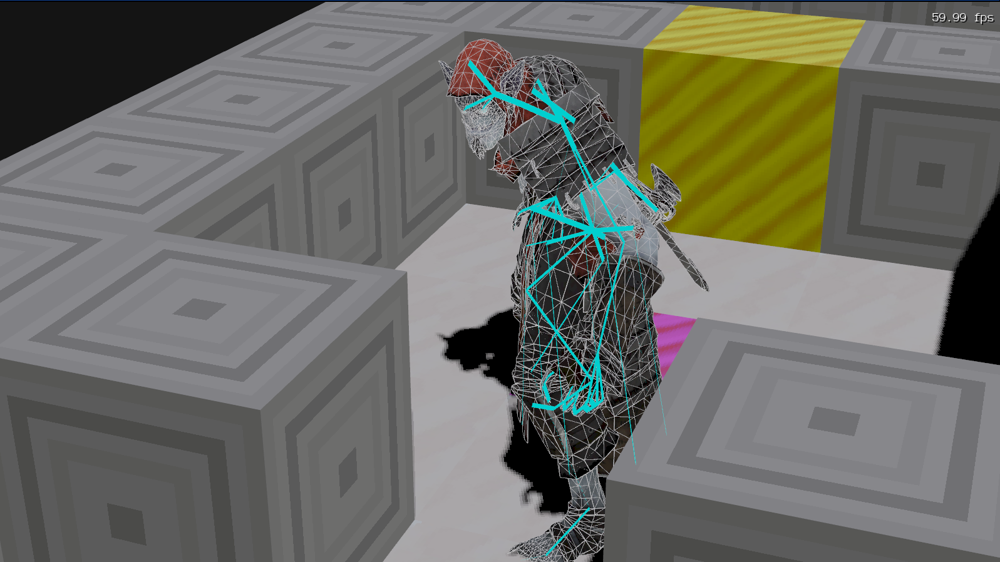

# Untitled block pushing game

The engine features:

- Shadow mapping (PCF).
- Skeletal animation.
- Animation HUD, Animation graph for minute controls.
- glTF (and FBX) loading.
- PBR material system.
- Immediate-mode GUI library (has buttons, text inputs, checkboxes, comboboxes, window panels, slidable regions, scrollable regions, ...).
- Font rendering with FreeType.
- Custom allocators and data structures (dynamic arrays, hash tables, pools, bucket arrays, ...).
- Also, it is a Sokoban style game, with game logic and entity system.

